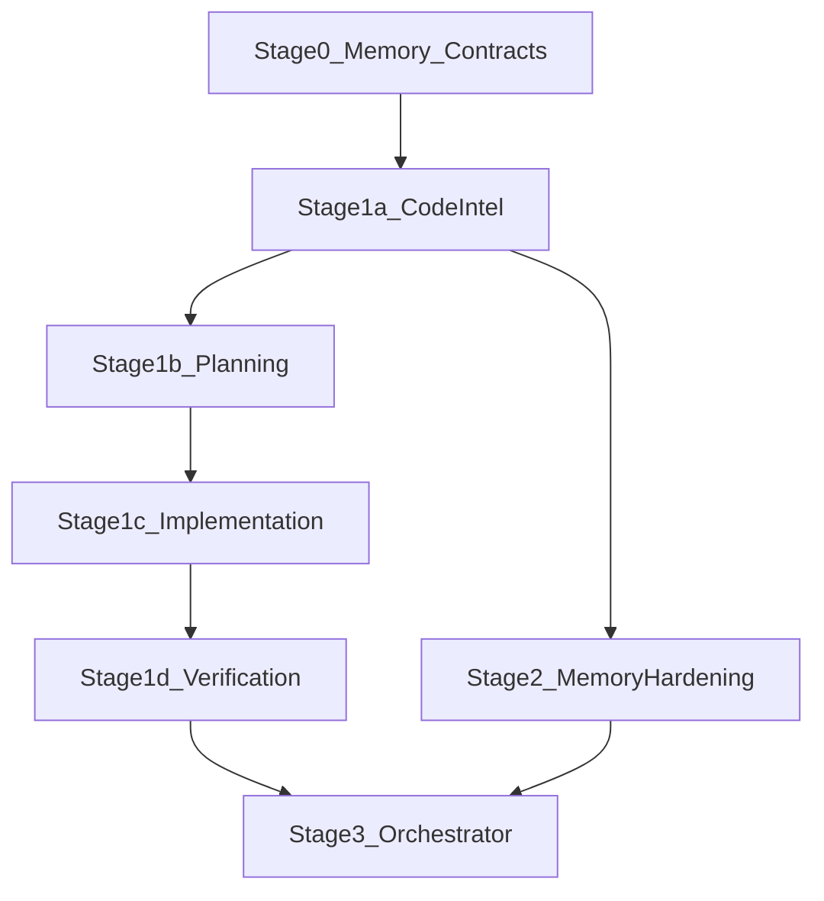

# Peer-Coder Agent Build Roadmap

**Audience:** Any human or coding agent implementing Peer-Coder.  
**Do not rely on chat history.** This document is the source of truth for build order, modularity, contracts, CLI, and exit criteria.

**Related:**
- [Memory LLD](./memory-lld.md) — L0–L5 agent state memory
- [Code Intel](./code-intel.md) — polyglot production index/search
- [Orchestration](./orchestration.md) — slim Orchestrator + substrate
- [Cognitive agent set](../src/agents/agents.md) — roles (Orchestrator last)
- [Supabase migrations](../supabase/migrations/) — durable memory schema

---

## How to use this doc

1. Find the **lowest incomplete stage** (status checkbox).
2. Implement only that stage’s deliverables.
3. Meet **exit criteria** before starting the next stage.
4. Obey **modularity rules** — violations are out of scope.
5. Update the stage status and **Changelog** when done.

---

## North-star principles

1. **Bottom-up** — specialists before Orchestrator.
2. **Modularity is compulsory** — isolated agent modules; shared code only via contracts / memory / core.
3. **Independently executable** — each agent has CLI + tests without Orchestrator.
4. **Contract-first handoffs** — Zod envelopes in `src/agents/contracts/`.
5. **Shared memory substrate** — all agents use `MemoryManager` ([memory-lld](./memory-lld.md)).
6. **Git / docs are not agents** — tools only.

---

## Compulsory modularity rules

| Rule | Requirement |
|------|-------------|
| One module per agent | `src/agents/<agent_id>/` owns definition, schema, handler, graph/nodes, state, index |
| No runtime in definition/graph | `definition.ts` and `graph.ts` must not import registries/runtime |
| Manifest isolation | `src/agents/manifests/<agent>.ts` wires `{ definition, handler }` only |
| Shared types | Cross-agent Zod/TS in `src/agents/contracts/` or `src/memory/domain/` |
| Tools in `src/tools/` | Agents call tools via container; do not reimplement FS/git |
| Memory via MemoryManager | No ad-hoc Maps for task/execution state inside agents |
| CLI one command file | `src/cli/<command>.ts`; may only `execute(agentId, …)` |
| Tests by layer | `tests/agents/<agent_id>/`, `tests/memory/`, `tests/cli/` |
| Status flag | `experimental` until exit criteria; then `stable` |
| No Orchestrator dep | Specialist tests must pass with Orchestrator unregistered |

### Canonical agent module skeleton

```text
src/agents/<agent_id>/
  schema.ts
  definition.ts
  state.ts        # if LangGraph
  nodes.ts
  graph.ts        # no registry imports
  handler.ts
  index.ts

src/agents/manifests/<agent_id>.ts
tests/agents/<agent_id>/*.test.ts
src/cli/<cli_name>.ts
tests/cli/<cli_name>.test.ts
```

---

## Build order (locked)

```text
Stage 0   Shared memory + contracts + wiring     ← foundation
Stage 1a  Code Intelligence
Stage 1b  Planning
Stage 1c  Implementation
Stage 1d  Verification
Stage 2   Memory hardening (L2–L5 adapters)
Stage 3   Orchestrator (workflow glue only)     ← last
```



---

## Do not build (until listed)

| Item | Rule |
|------|------|
| Orchestrator | Not until Stage 3 preconditions met |
| Git Agent | Never — use `git_*` tools |
| Documentation Agent | Never — Implementation/Review task |
| Main-LLM memory classifier | Never — deterministic Memory Planner only |

---

## Contract catalog

Shared Zod schemas: [`src/agents/contracts/`](../src/agents/contracts/)

| Contract | Used by |
|----------|---------|
| `CodeIntelResult` | Code Intelligence → Planning / Orchestrator |
| `PlanResult` | Planning → Implementation / L1 |
| `ImplementationResult` | Implementation → Verification |
| `VerificationResult` | Verification → Debugging (future) |

---

## Memory integration cheat sheet

Full design: [memory-lld.md](./memory-lld.md).

| Layer | Stage 0 | Stage 2 |
|-------|---------|---------|
| L0 Execution | In-process Map | Same |
| L1 Task | In-process Map | Optional Supabase `tasks` |
| L2 Facts | Empty recall | Supabase `repository_facts` |
| L3 Symbols | In-memory store (1a) | Supabase `files`/`symbols`/`symbol_edges` |
| L4 Episodes | No-op promote | Supabase `episodes` |
| L5 Prefs | Empty | Supabase `user_preferences` |

API: `MemoryManager.planAndRecall`, `getExecution`, `getTask`, `updateExecution`, `promote`.

Dual context: `{ systemMemory, taskMemory }` for prompt caching.

---

## CLI map

| Stage | Command | Agent | Independent? |
|-------|---------|-------|----------------|
| done | `/analyze` | `workspace_intelligence` | yes |
| 0+ | (runtime wiring) | — | — |
| 1a | `/code-intel <q>` | `code_intelligence` | yes |
| 1b | `/plan "..."` | `planning` | yes |
| 1c | `/implement <taskId>` | `implementation` | yes |
| 1d | `/verify` | `verification` | yes |
| 3 | freeform / `run` | `orchestrator` | uses others |

---

## Stage 0 — Shared memory, contracts, wiring

**Status:** [x] Done (initial implementation)

### Purpose

Foundation every specialist imports. No new cognitive agent.

### Dependencies

None (WI already exists).

### Files

```text
src/memory/domain/*
src/memory/storage/l0_execution_store.ts
src/memory/storage/l1_task_store.ts
src/memory/storage/l3_symbol_store.ts
src/memory/planner/need_extractors.ts
src/memory/planner/memory_planner.ts
src/memory/context/budget_manager.ts
src/memory/context/context_builder.ts
src/memory/memory_manager.ts
src/memory/index.ts
src/agents/contracts/*.ts
src/agents/core/execution_context.ts   # optional memoryManager
src/agents/runtime/container_factory.ts
src/agents/runtime/agent_runtime.ts    # L0 bind + prompt pack metadata
tests/memory/*.test.ts
```

### Exit criteria

- [x] Unit tests for L0/L1 and need extractors
- [x] Container exposes `memoryManager`
- [x] Contracts compile from `src/agents/contracts/`
- [x] This section matches code

### Out of scope

Orchestrator, Supabase adapters, HITL.

---

## Stage 1a — Code Intelligence

**Status:** [x] Done (initial implementation)

### Purpose

Symbol/file/reference graph for **any language**; fill L3; unblock Planning.

**Status:** [x] Done (polyglot production substrate — see [`code-intel.md`](./code-intel.md))

### Dependencies

Stage 0.

### Files

```text
src/code_intel/**                 # PolyglotIndexEngine, walk, parsers, hybrid search, LSP seam
src/agents/code_intelligence/*
src/agents/manifests/code_intelligence.ts
src/cli/code_intel.ts
tests/fixtures/polyglot/**
tests/code_intel/polyglot.test.ts
docs/code-intel.md
```

### Contract

See `CodeIntelResult` in contracts. Input: `{ workspacePath, query, symbolHint?, maxFiles? }`.

### CLI

```bash
peer-coder code-intel PaymentService
# works on Python/Go/Rust/Java/C++/TS fixtures alike
```

### Exit criteria

- [x] Polyglot fixtures (Python/Go/…) return symbols without requiring `.ts`
- [x] L3 upsert on success
- [x] `find_symbol` / `find_references` wired (never empty stubs)
- [x] Incremental index + gitignore walk + degradation

### Out of scope

File edits, Orchestrator, shipping language servers by default.

---

## Stage 1b — Planning

**Status:** [x] Done (initial implementation)

### Purpose

Requirement → ordered tasks + acceptance criteria → L1 `TaskState`. No modify tools.

### Dependencies

Stage 0; optional CodeIntelResult input.

### Files

```text
src/agents/planning/*
src/agents/manifests/planning.ts
src/cli/plan.ts
tests/agents/planning/*
tests/cli/plan.test.ts
```

### Contract

`PlanResult` — `taskId`, `goal`, `tasks[]`, `order`, `risks`, `acceptanceCriteria`, `testStrategy`.

### CLI

```bash
peer-coder plan "Add OAuth"
# REPL: /plan Add OAuth
```

### Exit criteria

- [x] Creates L1 task + returns `taskId`
- [x] Zod-valid `PlanResult`
- [x] No write tools in `allowedTools`

---

## Stage 1c — Implementation

**Status:** [x] Done (initial implementation)

### Purpose

Execute a plan step: patch/create via tools; update L0/L1.

### Dependencies

Stage 0 + 1b (L1 task).

### Files

```text
src/agents/implementation/*
src/agents/manifests/implementation.ts
src/cli/implement.ts
tests/agents/implementation/*
tests/cli/implement.test.ts
```

### Contract

`ImplementationResult` — `filesChanged`, `diffSummary`, `completedStepIds`, `notes`.

### CLI

```bash
peer-coder implement <taskId>
# REPL: /implement <taskId>
```

### Exit criteria

- [x] Loads task from L1; updates todos / filesTouched
- [x] Works without Orchestrator
- [x] Git remains tools only

---

## Stage 1d — Verification

**Status:** [x] Done (initial implementation)

### Purpose

Run typecheck/lint/test as available; structured `VerificationResult`.

### Dependencies

Stage 0; optional L1 acceptance criteria.

### Files

```text
src/agents/verification/*
src/agents/manifests/verification.ts
src/cli/verify.ts
tests/agents/verification/*
tests/cli/verify.test.ts
```

### Contract

`VerificationResult` — `passed`, `commandsRun`, `failures`, `acceptance`.

### CLI

```bash
peer-coder verify
# REPL: /verify
```

### Exit criteria

- [x] Returns Zod-valid result with structured failures
- [x] Does not modify source to “fix” failures

---

## Stage 2 — Memory hardening

**Status:** [x] Done (L2/L4/L5 in-process + optional Supabase sync; offline default)

### Purpose

Supabase adapters + promotion policy. Agents must still run offline.

### Deliverables

- [x] L2/L3/L4/L5 store adapters under `src/memory/storage/`
- [x] `promotion_policy.ts`, TTL helpers
- [x] Graceful skip when `SUPABASE_*` unset
- [x] WI seeds L2 via `MemoryManager.seedRepositoryProfile`

### Exit criteria

- [x] WI can seed L2 when Supabase present (best-effort sync)
- [x] Code Intel can optionally sync L3 (in-memory promote path)
- [x] In-memory fallback always works

---

## Stage 3 — Orchestrator (last)

**Status:** [x] Done (slim Orchestrator + Research + substrate — see [`orchestration.md`](./orchestration.md))

### Preconditions

- [x] WI exists
- [x] Code Intel + Planning exist (minimum)
- [x] Implementation + Verification exist
- [x] Contracts + typed artifacts + Task Manager / Journal / Context Engine / Workspace Graph

### Purpose

Workflow glue only: deterministic router + `AgentRuntime.execute` children. `allowedTools: []`. Task Manager owns L1.

### Exit criteria

- [x] Freeform REPL → orchestrator
- [x] Specialists never import orchestrator
- [x] Missing agent → PARTIAL + `blockedOn`
- [x] Research gate + failure matrix

---

## Changelog

| Date | Change |
|------|--------|
| 2026-07-31 | Stage 3 Orchestrator + Research + shared substrate (artifacts, Task Manager, Journal, Context Engine, Workspace Graph) |
| 2026-07-30 | Initial roadmap doc; Stages 0–1d implemented; Stage 3 deferred |
