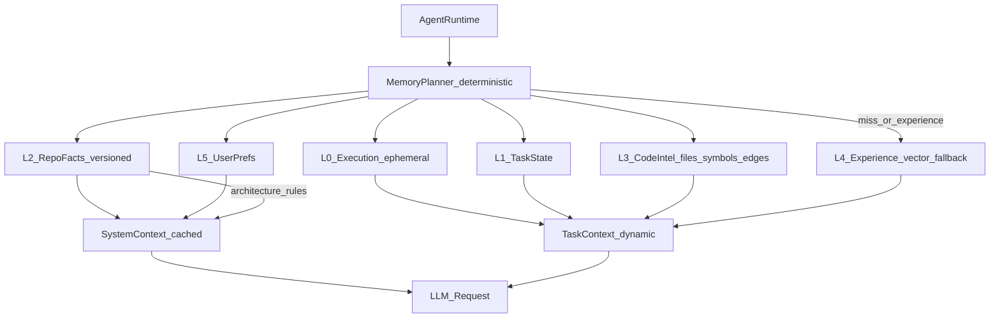
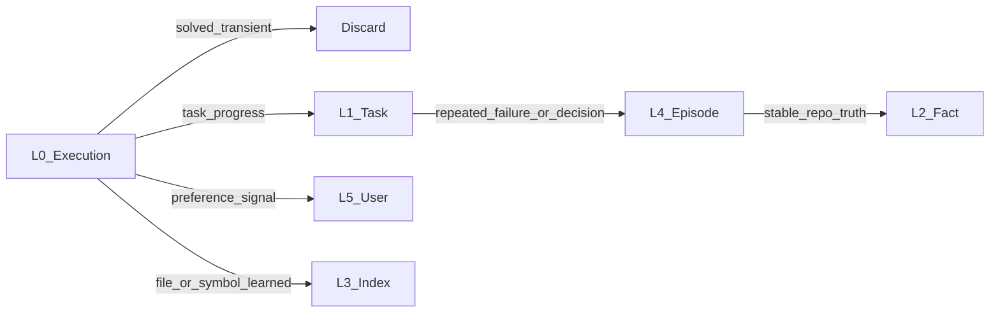
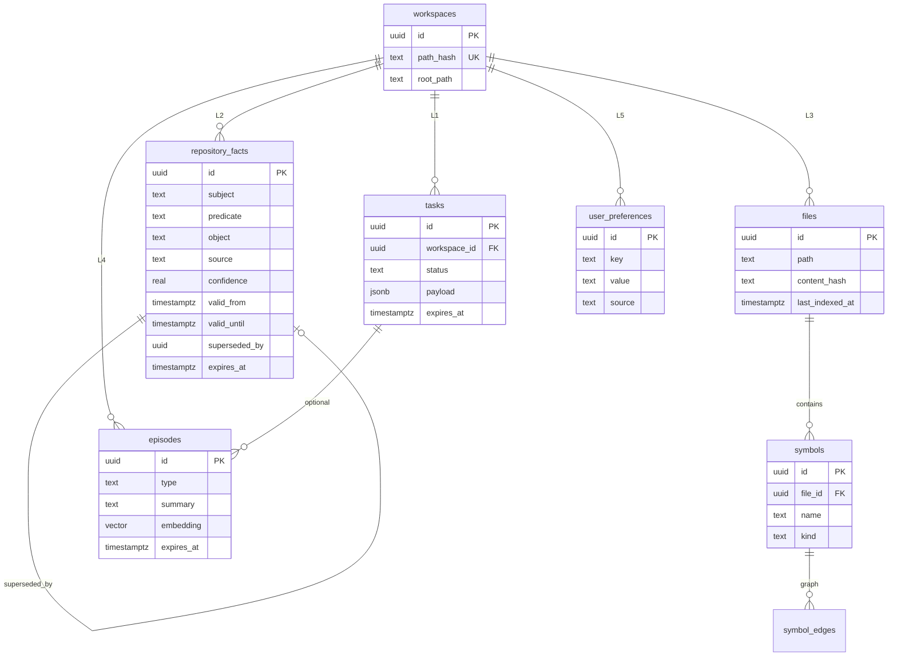
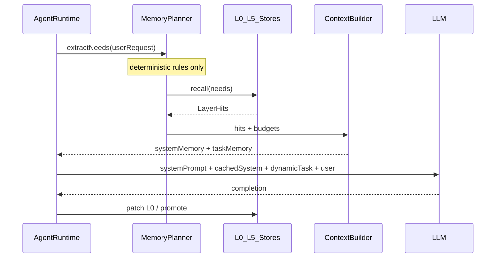

# Memory System LLD — Agent State Architecture

**Status:** Frozen (ADD Chapter 6)  
**Scope:** Low-level design + Supabase schema. No AgentRuntime wiring or TypeScript implementation in this document’s companion migrations phase.  
**Schema:** [`supabase/migrations/`](../supabase/migrations/)

---

## 1. North-star

> **The LLM is a reasoning engine on already-selected context — never the memory search engine.**

| Goal | Target |
|------|--------|
| Deterministic recalls | 80–95% of needs satisfied by L0–L3 / L5 |
| Vector / RAG | L4 last resort only |
| Context shape | Structured JSON, dual-split for prompt caching |
| Writes | Curated promotion only — not every message/tool dump |

**Rejected:** `every request → embed → vector search → rank → LLM interprets memory`.

---

## 2. Architecture overview

Memory is the **cognitive substrate** of Peer-Coder: a CPU-cache-style hierarchy with a deterministic **Memory Planner** that routes information needs to the cheapest store.



**Routing priority** (after binding L0 / known L1):

```text
L0 Execution → L3 Code Intel → L2 Facts → L5 User → L1 Task → L4 Experience (vector last)
```

When `taskId` is known, L1 is always loaded O(1) — it does not wait for a miss cascade.

---

## 3. Layer model (L0–L5)

| Level | Name | Contents | Store | Lookup | Embeddings |
|-------|------|----------|-------|--------|------------|
| **L0** | Execution | goal, plan, visitedFiles, errors, pendingActions, currentToolResults | `Map<executionId, ExecutionState>` | executionId | Never |
| **L1** | Task | todos, decisions, filesTouched, knownIssues, architectureNotes | `tasks.payload` JSONB | taskId | Never |
| **L2** | Repository facts | versioned triples `(subject, predicate, object)` | `repository_facts` | subject/predicate + current view | Never |
| **L3** | Code intel | **files → symbols → edges** | `files`, `symbols`, `symbol_edges` | path / name / graph | Never |
| **L4** | Experience | decisions, failures, lessons (small corpus) | `episodes` + nullable vector | typed filter → vector last | Yes, last resort |
| **L5** | User prefs | key → value | `user_preferences` | `(workspace_id, key)` | Never |

### 3.1 L0 — Execution Memory (nothing reusable)

AST caches and durable tool dumps do **not** belong here. If Agent A reads a file, Agent B in the same repo must benefit via **L3**, not L0.

```ts
interface PlanStep {
  id: string;
  title: string;
  status: "pending" | "active" | "done" | "skipped";
}

interface ExecutionState {
  executionId: string;
  workspaceId: string;
  taskId?: string;
  goal: string;
  currentPlan: PlanStep[];
  visitedFiles: string[];       // this run only — path pointers, not AST
  activeErrors: string[];
  pendingActions: string[];
  currentToolResults: unknown[]; // capped, this turn only
  updatedAt: string;
}
```

**TTL:** execution lifetime — drop Map entry on complete/cancel.

### 3.2 L1 — Task Memory

```ts
interface TaskState {
  id: string;
  workspaceId: string;
  goal: string;
  status: "active" | "done" | "abandoned";
  todos: { id: string; title: string; done: boolean }[];
  completed: string[];
  remaining: string[];
  knownIssues: string[];
  decisions: { summary: string; at: string }[];
  filesTouched: string[];
  architectureNotes: string[];
}
```

Lookup: `getTask(taskId)` — O(1). Entire feature lifetime.

### 3.3 L2 — Repository Facts (versioned)

Triples only — never prose paragraphs.

```text
(project, uses, TypeScript)
(project, package_manager, pnpm)
(project, database, Supabase)
```

Facts are **temporal**: `valid_from` / `valid_until` / `superseded_by`.  
Current view: `valid_until IS NULL AND (expires_at IS NULL OR expires_at > now())`.

Example: Redux (2025) superseded by Zustand (2026) — migration history is retained.

### 3.4 L3 — Code Intelligence (`files` → symbols → edges)

**Language-agnostic.** Symbols are language-tagged and filled by the polyglot `IndexEngine` (tree-sitter WASM parsers + generic fallback + hybrid ripgrep search). See [`code-intel.md`](./code-intel.md).

Symbols alone cannot answer “Find authentication implementation.” Bootstrap path:

```text
search files → symbols in those files → edges
```

```ts
interface FileRecord {
  id: string;
  workspaceId: string;
  path: string;
  language?: string;
  sizeBytes: number;
  contentHash: string;
  lastIndexedAt: string;
}

interface SymbolRecord {
  id: string;
  workspaceId: string;
  fileId: string;
  name: string;
  kind: string;
  startLine: number;
  endLine: number;
  exported: boolean;
  signature?: string;
}

type SymbolRelation =
  | "imports"
  | "calls"
  | "extends"
  | "implements"
  | "references"
  | "exports";

interface SymbolEdge {
  fromSymbolId: string;
  toSymbolId: string;
  relation: SymbolRelation;
}
```

L3 may be sparsely populated until the Code Intelligence agent / indexer fills it. Empty L3 simply falls through the router.

### 3.5 L4 — Experience Memory (small RAG corpus)

Target scale: **5k–20k** curated rows per workspace over time — not chat dumps.

Types: `decision` | `failure` | `solution` | `architecture_change` | `lesson`.

**Default read:** filter by workspace + type + related files/symbols.  
**Vector RPC (`match_episodes`):** only when planner need is `experience` / `unknown` and typed filter is insufficient.

Embeddings: `nomic-embed-text`, **768 dims**, column **nullable** until promoted to searchable.

### 3.6 L5 — User Preferences

Tiny hash map: prefers pnpm, uses Ollama, prefers production architecture, etc.  
Upsert on change; no expiry by default.

---

## 4. Memory Planner (deterministic — no main LLM)

`extractNeeds` uses **rules and extractors only**. The production chat model must never classify memory routes.

```ts
type EpisodeType =
  | "decision"
  | "failure"
  | "solution"
  | "architecture_change"
  | "lesson";

type MemoryNeed =
  | { kind: "execution" }
  | { kind: "task" }
  | { kind: "file"; pathHint?: string; textHint?: string }
  | { kind: "symbol"; name?: string }
  | { kind: "repo_fact"; subject?: string; predicate?: string }
  | { kind: "preference"; key?: string }
  | { kind: "experience"; episodeTypes?: EpisodeType[] }
  | { kind: "unknown" };

interface RecallContext {
  workspaceId: string;
  executionId: string;
  taskId?: string;
  sessionId?: string;
}

interface MemoryPlanner {
  /** Rules + extractors only — no main LLM */
  extractNeeds(request: string, ctx: RecallContext): MemoryNeed[];
  recall(needs: MemoryNeed[], ctx: RecallContext): Promise<LayerHits>;
}
```

### 4.1 Example rule cascade

Input: `"Why is AgentRuntime failing?"`

| Signal | Need |
|--------|------|
| PascalCase / known symbol token `AgentRuntime` | L3 symbol lookup |
| `fail` / `why` / `error` heuristics | L4 `type=failure` filter |
| path-like tokens (`src/foo.ts`) | L3 files |
| package/stack keywords | L2 facts |
| preference verbs (`prefer`, `always use`) | L5 |

Residual **unknown** may use a **cheap tiny classifier** (local small model / keyword heuristics) — **never** the main reasoning LLM.

### 4.2 Public runtime API (future)

```ts
interface MemoryManager {
  planAndRecall(request: string, ctx: RecallContext): Promise<AgentPromptPack>;
  getExecution(executionId: string): ExecutionState | null;
  getTask(taskId: string): Promise<TaskState | null>;
  updateExecution(patch: Partial<ExecutionState>): void;
  promote(event: PromotionEvent): Promise<void>;
}
```

There is **no** default `recall() → hybrid_memory_search` path.

---

## 5. Source, confidence, and conflict rules

```ts
type MemorySource = "user" | "analyzer" | "agent" | "inference";

interface MemoryConfidence {
  source: MemorySource;
  confidence: number; // 0–1
}
```

**Trust order for observed repo truth (L2):**

```text
analyzer (verified/observed)  >  agent  >  inference  >  user statement
```

**Conflict rules:**

| Question | Winner |
|----------|--------|
| “What package manager is **in the repo**?” | L2 analyzer fact (e.g. lockfile / packageManager field) |
| “What should we **use going forward**?” | L5 user preference when explicitly set |
| Same predicate, multiple current L2 rows | Higher `confidence`, then trust order, then newer `valid_from` |

Example: user said “use pnpm” (L5, 0.9) vs analyzer saw npm in `package.json` (L2, 1.0) → report npm for current state; honor pnpm as preference for future tooling choices.

---

## 6. TTL policies

| Layer | TTL | Mechanism |
|-------|-----|-----------|
| L0 | execution lifetime | drop Map on complete |
| L1 | task lifetime | soft-close on done; optional `expires_at` |
| L2 | months/years | `expires_at` nullable; prefer supersession over delete |
| L3 | until reindex / hash change | `last_indexed_at`; invalidate on `content_hash` mismatch |
| L4 failure | **90 days** unless repeated | `expires_at`; refresh on repeat |
| L4 decision/lesson | longer / until superseded | |
| L5 | forever until changed | upsert; `expires_at` NULL |

All durable tables include `expires_at timestamptz NULL`.

---

## 7. Ranking — information density

```text
score   = f(importance, confidence, recency, source_trust)
utility = score / max(token_cost, 1)
```

Fill each layer’s token budget by **highest utility first**. A 0.90 / 50-token fact beats a 0.95 / 500-token blob.

```ts
interface RankedItem {
  score: number;
  tokenCost: number;
  utility: number;
  source: MemorySource;
  confidence: number;
}
```

### 7.1 Layered token budgets (defaults)

| Slice | Budget | Source |
|-------|--------|--------|
| L0 Execution | ~3k | Map objects, truncated tool results |
| L1 Task | ~2k | TaskState JSON |
| L2 Repository | ~1k | current facts as key→value |
| L3 Files/Symbols | ~3k | relevant cards only |
| L4 Experience | **≤4k max** | last resort |
| L5 User | ~200 | prefs |
| **Memory total** | **~13.2k** | not a flat 20k RAG dump |

---

## 8. Dual ContextBuilder (prompt caching)

Do **not** merge everything into one memory blob.

| Pack | Contents | Stability |
|------|----------|-----------|
| **System / Cached Memory Context** | L2 current facts, L5 prefs, architecture rules | Stable across turns → prompt-cache friendly |
| **Task / Dynamic Context** | L0, L1, L3 hits, optional L4 | Changes every request |

```text
LLM Request =
  System Prompt
  + Cached Memory Context   (L2 + L5 + rules)
  + Dynamic Task Context    (L0 + L1 + L3 + optional L4)
  + User Request
```

```ts
interface SystemMemoryContext {
  repository: Record<string, string>; // predicate → object (current)
  user: Record<string, string>;
  architectureRules: string[];
}

interface TaskMemoryContext {
  execution?: ExecutionState;
  task?: TaskState;
  files: FileRecord[];
  symbols: SymbolRecord[];
  recentDecisions: string[];
  recentFailures: string[];
  episodes: { type: EpisodeType; summary: string }[];
}

interface AgentPromptPack {
  systemMemory: SystemMemoryContext;
  taskMemory: TaskMemoryContext;
}
```

Example dynamic payload (illustrative):

```json
{
  "task": { "goal": "Implement memory substrate", "remaining": ["indexer", "tests"] },
  "execution": {
    "visitedFiles": ["agent_runtime.ts"],
    "activeErrors": [],
    "pendingActions": ["write LLD"]
  },
  "symbols": [{ "name": "AgentRuntime", "file": "agent_runtime.ts", "kind": "class" }],
  "recentFailures": [],
  "episodes": []
}
```

---

## 9. Promotion pipeline

Nothing becomes an episode by default.



| Signal | Destination |
|--------|-------------|
| Compile error, then fixed | L0 only → discard |
| Task progress | L1 payload update |
| Failed approach tried N times | L4 episode (`failure`) |
| Repo uses pnpm (stable) | L2 fact (new row; supersede old) |
| User always wants strict typing | L5 upsert |
| File/symbol learned from read | L3 index — **not** L0/L1 |

---

## 10. AgentRuntime integration (design — next phase)

```text
AgentRuntime.run
  1. Bind/create L0 ExecutionState for executionId
  2. MemoryPlanner.extractNeeds(request, ctx)     // deterministic
  3. Fill needs: L0 → L3 → L2 → L5 → L1; L4 only on experience/unknown miss
  4. ContextBuilder → { systemMemory, taskMemory }
  5. handler.execute(..., agentPromptPack)
  6. Patch L0; upsert L3 on file reads; MemoryManager.promote(...)
```

Extend `AgentContainer` later with optional `memoryManager`. Keep existing KV `MemoryService` as unrelated scratch. Emit `memory.read` / `memory.write` events from the event store when wired.

**Seed paths:**

- L2 facts ← [`WorkspaceContext`](../src/workspace/context/workspace_context.ts) / workspace analyzer (`source=analyzer`, high confidence)
- L3 ← future Code Intelligence agent + indexer

---

## 11. Target TypeScript layout (not implemented yet)

```text
peer-coder/src/memory/
  domain/       execution_state, task_state, fact, file, symbol, episode, preference, needs, confidence, budgets
  storage/      l0…l5 stores (l3 includes files)
  planner/      memory_planner.ts, need_extractors.ts
  context/      context_builder.ts, budget_manager.ts
  curation/     promotion_policy.ts, ttl_policy.ts
  retrieval/    episode_search.ts   # L4 typed → vector
```

---

## 12. Database design

Migrations:

1. [`001_extensions.sql`](../supabase/migrations/001_extensions.sql) — `vector`, `pg_trgm`
2. [`002_memory_schema.sql`](../supabase/migrations/002_memory_schema.sql) — tables + constraints
3. [`003_memory_indexes.sql`](../supabase/migrations/003_memory_indexes.sql) — indexes + last-resort `match_episodes`

### 12.1 ER diagram



### 12.2 Auth / tenancy

**No login / RLS for now.** Rows scoped by `workspace_id` (hash of absolute workspace path). CLI uses service role when set, else anon. Enable RLS when multi-user lands.

### 12.3 Non-goals for schema v1

- Generic `documents` / always-on `hybrid_memory_search` entrypoint
- Embedding every fact or preference
- Neo4j (edges live in Postgres)
- Redis L0 (in-process Map is enough; Redis optional later)

---

## 13. Dual-context sequence



---

## 14. Locked defaults

| Decision | Choice |
|----------|--------|
| Architecture type | Agent state / cognitive substrate (not RAG-first) |
| L0 | Ephemeral only; no AST cache |
| L3 | files → symbols → edges |
| L2 | Temporal facts + supersession |
| Planner | Deterministic rules; never main LLM |
| Trust order | analyzer > agent > inference > user (with L5 desire vs L2 observe) |
| TTL | Per-layer; L4 failures 90d; L5 forever |
| Ranking | `utility = score / token_cost` |
| Context | Dual: cached system (L2+L5) + dynamic task (L0+L1+L3+L4) |
| Vector | L4 last resort only (`match_episodes`) |
| Embedding dim | 768 (`nomic-embed-text`) |
| Auth | None; workspace path hash |

---

## 15. Out of scope (this phase)

- TypeScript `src/memory/` implementation
- AST / symbol indexer fill jobs
- AgentRuntime / container wiring
- Redis working store
- Auth / RLS policies
- Main-LLM or production-model classifier for memory routing
