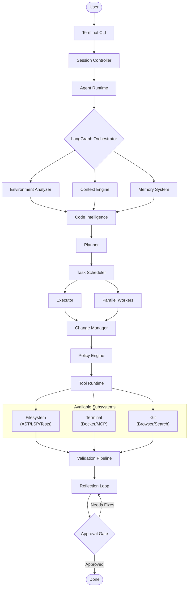

I actually think this deserves to be treated like a **software architecture specification**, not a chat response.

Considering your goal (building a production-grade coding agent that can compete architecturally with Claude Code, OpenHands, Gemini CLI, Cursor Agent, etc.), I'd structure it as an **Architecture Design Document (ADD)** that evolves over multiple iterations.

I'd break it into roughly these chapters:

1. Vision & Design Principles
2. High-Level System Architecture
3. Complete Agent Workflow (end-to-end)
4. Every Agent and its Responsibilities
5. LangGraph Orchestration Design
6. Memory Architecture
7. Repository Intelligence
8. Context Engineering Pipeline
9. Planning Engine
10. Task Scheduling & Parallelism
11. Worker Architecture
12. Tool Framework
13. Validation Pipeline
14. Reflection & Self-Healing
15. Human-in-the-Loop
16. CLI Architecture
17. Observability & Telemetry
18. Security Model
19. Performance & Token Optimization
20. Deployment Architecture
21. Failure Recovery
22. Extensibility & Plugin System

Each chapter would include:

* Design goals
* Responsibilities
* Mermaid diagrams
* Component interactions
* Data flow
* State transitions
* Directory structure
* Interfaces
* Trade-offs
* Production considerations

This will likely be **80–120+ pages of Markdown** with dozens of Mermaid diagrams if done properly. That's far beyond what fits in a single chat response.

Given your long-term objective of building a serious production-grade coding agent and preparing at a Staff Engineer level, I think that's the right level of detail rather than trying to compress it into one message.

I would freeze the cognitive layer at these seven roles:

Orchestrator Agent
Environment Analyzer Agent
Code Analysis Agent
Planning Agent
Implementation Agent
Validation Agent
Reflection Agent